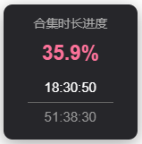

# bili-series-hourglass
b站是常用的自主学习资源平台，许多网课/教程视频使用的是分p合集的形式，
但b站原生对分p合集视频在视频播放页仅提供各p时长以及视频选集（集数）。
然而通常情况下各p时长不一，难以准确判断学习/观看进度，
对于想要直观查看合集剩余时长/了解合集播放进度来说犹为不便，
故开发本浏览器插件，经测试兼容edge合chrome浏览器，可使用扩展-开发者模式进行导入。
本插件提供以下功能：
1.显示时间（已播/总时长）、百分比；
2.自定义悬浮位置；
3.切换悬浮窗布局方向（图例为竖向）。

AI声明：本插件使用GLM-5.2辅助开发
